# Comanda Digital — Arquitetura completa

> Documentação visual do sistema (DrinkGO / Chopp Palazzo Express)
> Versão atual do código em `c:\Users\Administrador\Desktop\python\comanda_digital_v3_full`

## Sumário

1. [Visão geral do sistema](#1-visão-geral-do-sistema)
2. [Stack tecnológico](#2-stack-tecnológico)
3. [Estrutura de pastas e módulos](#3-estrutura-de-pastas-e-módulos)
4. [Modelos de dados (ERD)](#4-modelos-de-dados-erd)
5. [Sistema de autenticação e sessão](#5-sistema-de-autenticação-e-sessão)
6. [Sistema de permissões (RBAC + override)](#6-sistema-de-permissões-rbac--override)
7. [Mapa de rotas](#7-mapa-de-rotas)
8. [Fluxo de pedido (mesa / retirada / delivery)](#8-fluxo-de-pedido)
9. [Estados do pedido](#9-estados-do-pedido)
10. [Estados da mesa e da chopeira](#10-estados-da-mesa-e-da-chopeira)
11. [Aluguel de chopeiras](#11-aluguel-de-chopeiras)
12. [Pagamento e geração do cupom (com Pix)](#12-pagamento-e-geração-do-cupom)
13. [Inventário (contagem diária)](#13-inventário-contagem-diária)
14. [Relatórios e exportações](#14-relatórios-e-exportações)
15. [Migrações automáticas no boot](#15-migrações-automáticas-no-boot)
16. [Persistência externa (db / fotos / chave pix / secret key)](#16-persistência-externa)
17. [Build e deploy (PyInstaller + Launcher)](#17-build-e-deploy)
18. [Rede local (mDNS + IP + NetBIOS)](#18-rede-local)
19. [Sidebar e ícones](#19-sidebar-e-ícones)

---

## 1. Visão geral do sistema

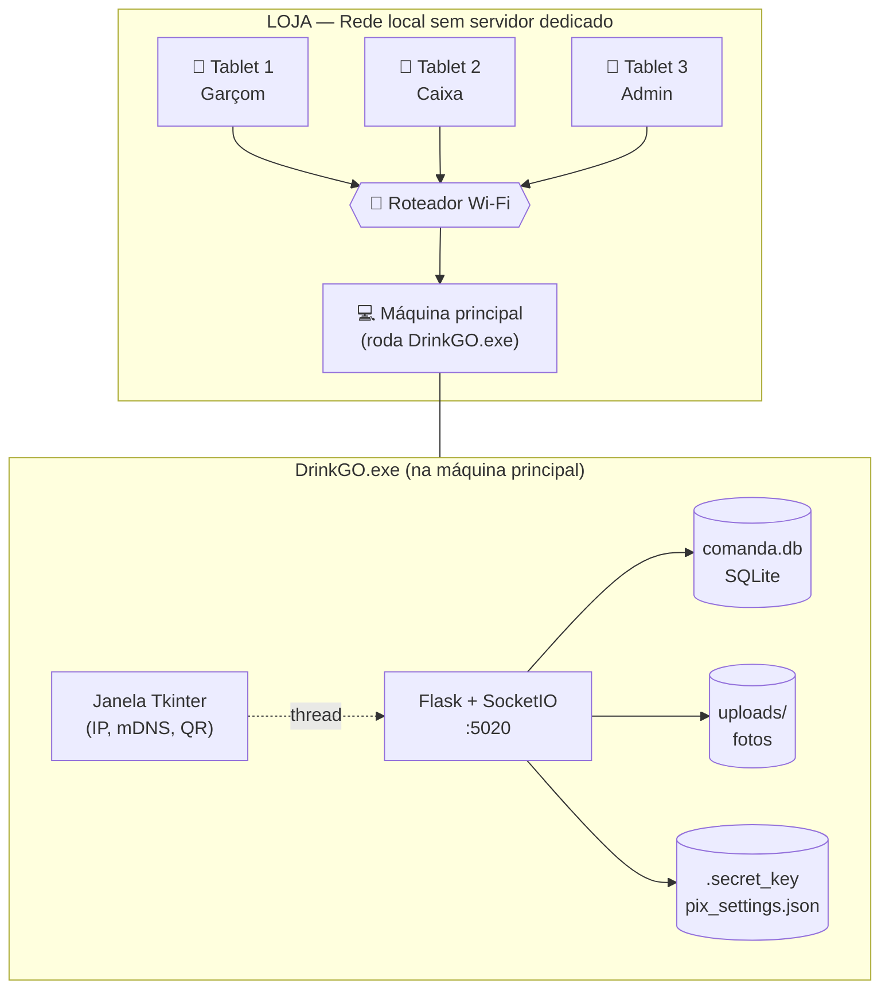

---

## 2. Stack tecnológico

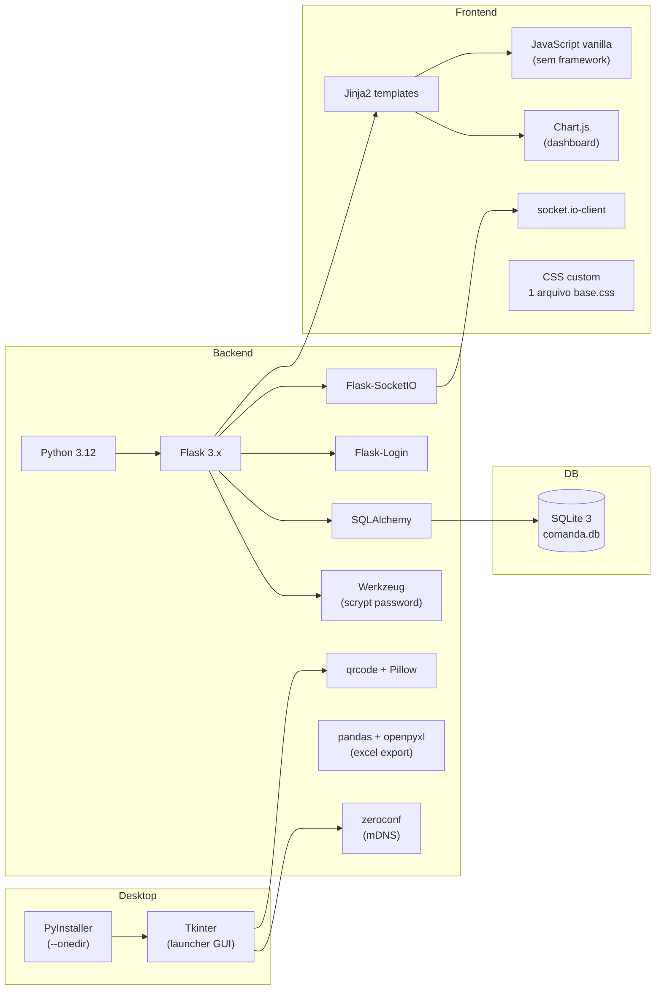

---

## 3. Estrutura de pastas e módulos

```mermaid
graph TB
    Raiz["📁 comanda_digital_v3_full/"]
    Raiz --> RunPy["run.py — entrypoint DEV"]
    Raiz --> LaunchPy["launcher.py — entrypoint EXE (GUI)"]
    Raiz --> ConfigPy["config.py — Config (PIX, sessão, db)"]
    Raiz --> BuilderTxt["Builder.txt — comando PyInstaller"]
    Raiz --> AppDir["📁 app/"]

    Raiz -. runtime .-> RuntimeFiles
    subgraph RuntimeFiles["arquivos persistentes (criados em runtime)"]
        DBFile["comanda.db"]
        SecretKey[".secret_key"]
        PixJson["pix_settings.json"]
        BackupsDir["📁 backups/"]
        UploadsDir["📁 uploads/<br/>├── produtos/<br/>└── usuarios/"]
    end

    AppDir --> Init["__init__.py — create_app, migrações, secret"]
    AppDir --> Models["models.py — SQLAlchemy ORM"]
    AppDir --> Sockets["sockets.py — SocketIO"]

    AppDir --> Auth["📁 auth/"]
    Auth --> AuthRoutes["routes.py — login/logout/perfil"]

    AppDir --> Public["📁 public/"]
    Public --> PubGarcom["garcom.py — pedidos garçom"]
    Public --> PubStatus["status.py — status pedido"]

    AppDir --> Admin["📁 admin/"]
    Admin --> AdmDashboard["dashboard.py"]
    Admin --> AdmPedidos["pedidos.py — caixa"]
    Admin --> AdmProdutos["produtos.py + categorias"]
    Admin --> AdmUsuarios["usuarios.py"]
    Admin --> AdmClientes["clientes.py"]
    Admin --> AdmChopeiras["chopeiras.py"]
    Admin --> AdmEntradas["entradas.py"]
    Admin --> AdmRel["relatorios.py + bonif_relatorio.py"]
    Admin --> AdmInv["inventario.py — contagem diária"]
    Admin --> AdmConfig["configuracao.py — chave Pix"]
    Admin --> AdmAPI["📁 api/ — JSON endpoints"]

    AppDir --> Utils["📁 utils/"]
    Utils --> UDecorators["decorators.py — role_required"]
    Utils --> UPermissoes["permissoes.py — registry + permissao_required"]
    Utils --> UPix["pix.py — BR Code + QR"]
    Utils --> UQR["qrcode_generator.py"]

    AppDir --> Templates["📁 templates/"]
    Templates --> TBase["base.html"]
    Templates --> TIcons["_icons.html — macros SVG"]
    Templates --> TAuth["📁 auth/"]
    Templates --> TAdmin["📁 admin/"]
    Templates --> TPublic["📁 public/"]
    Templates --> TErrors["📁 errors/"]

    AppDir --> Static["📁 static/"]
    Static --> CSS["css/base.css — único"]
    Static --> JS["js/* (dashboard, pedidos, chopeira, relatorios)"]
    Static --> Imagens["imagens/* (logo, favicon)"]
```

---

## 4. Modelos de dados (ERD)

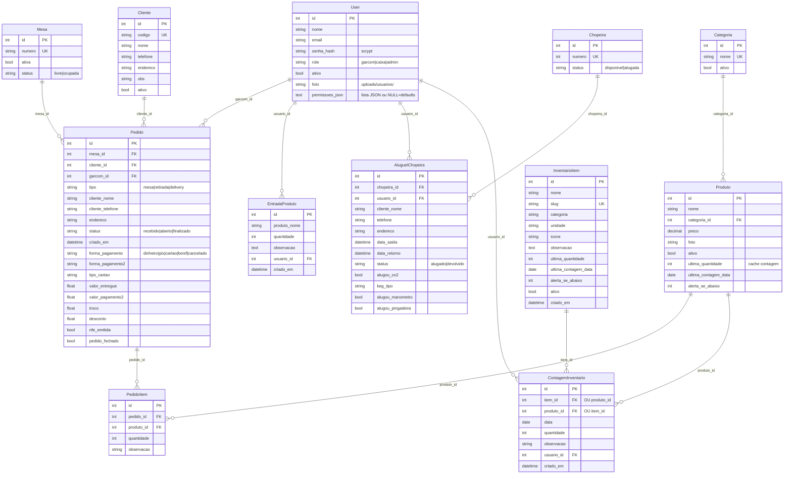

---

## 5. Sistema de autenticação e sessão

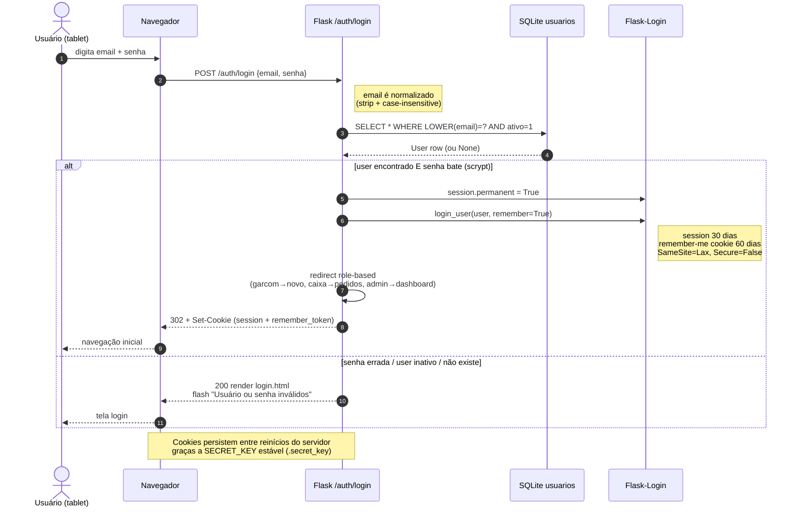

---

## 6. Sistema de permissões (RBAC + override)

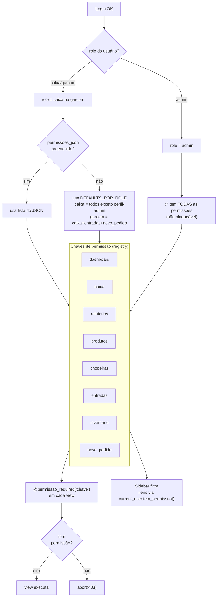

---

## 7. Mapa de rotas

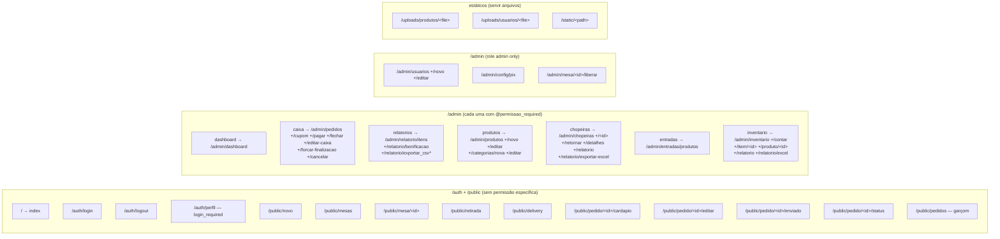

---

## 8. Fluxo de pedido

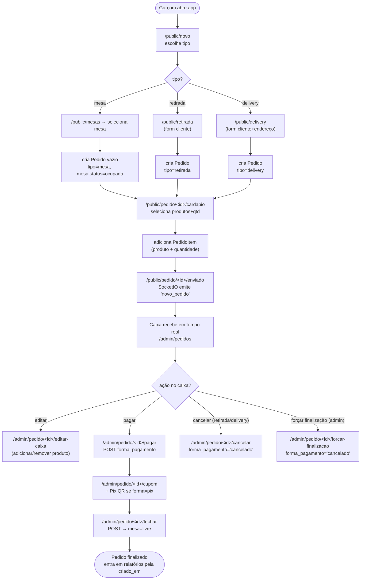

---

## 9. Estados do pedido

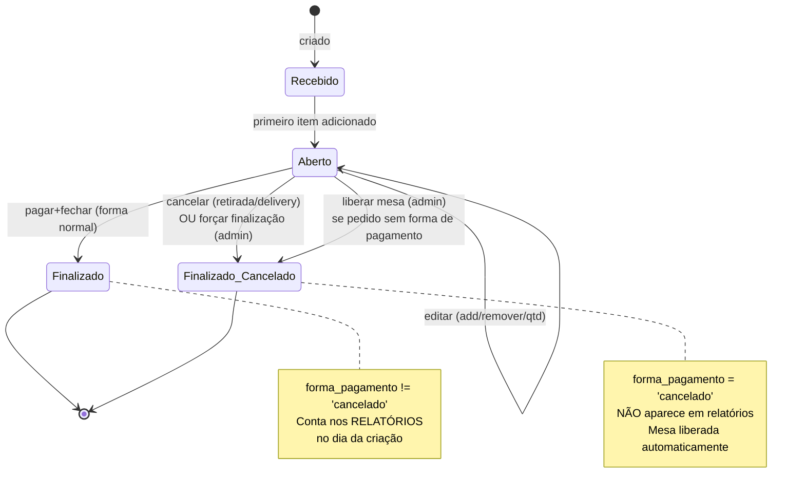

---

## 10. Estados da mesa e da chopeira

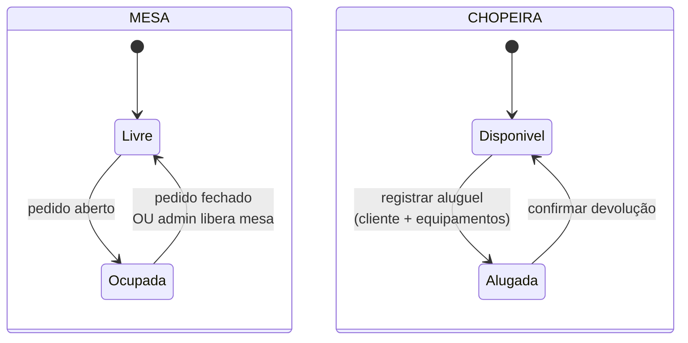

---

## 11. Aluguel de chopeiras

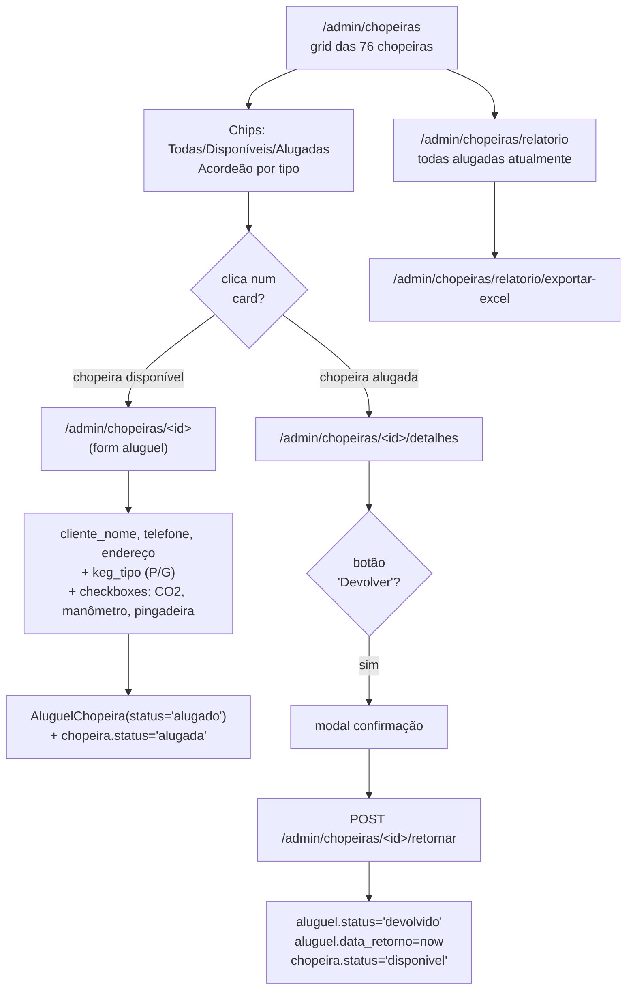

---

## 12. Pagamento e geração do cupom

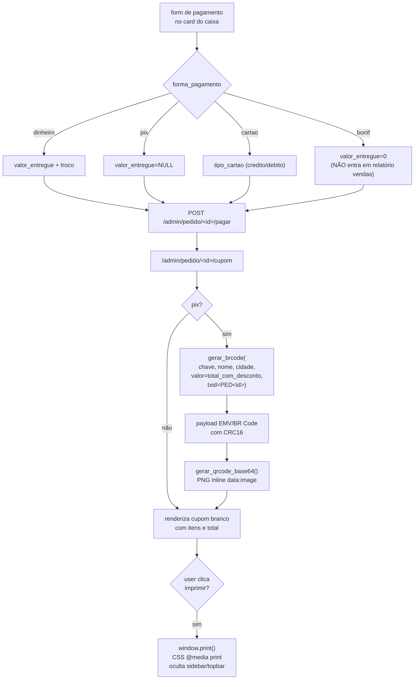

**Configuração da chave Pix** ([app/admin/configuracao.py](app/admin/configuracao.py)):

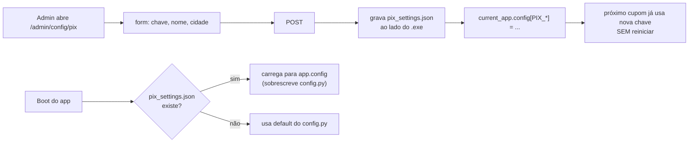

---

## 13. Inventário (contagem diária)

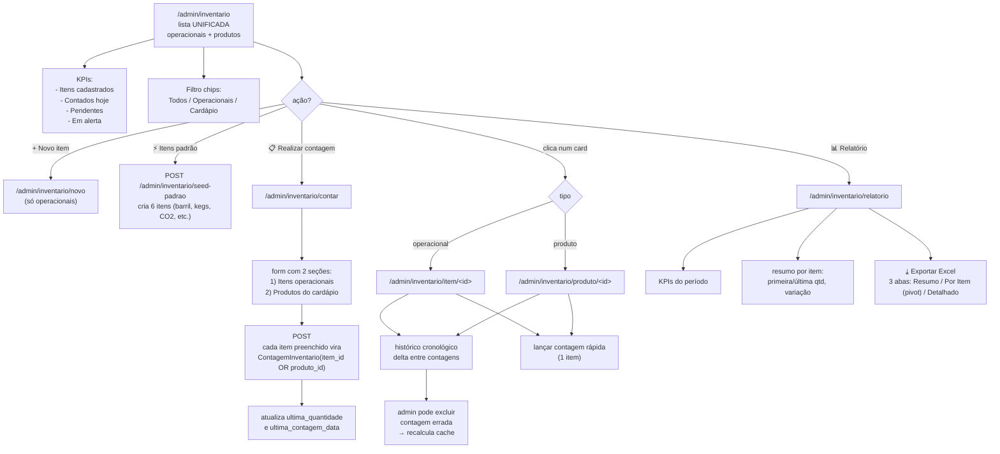

---

## 14. Relatórios e exportações

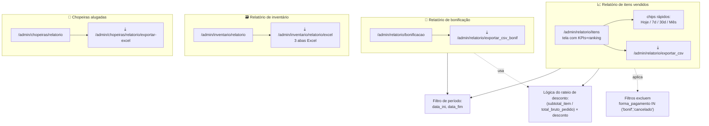

---

## 15. Migrações automáticas no boot

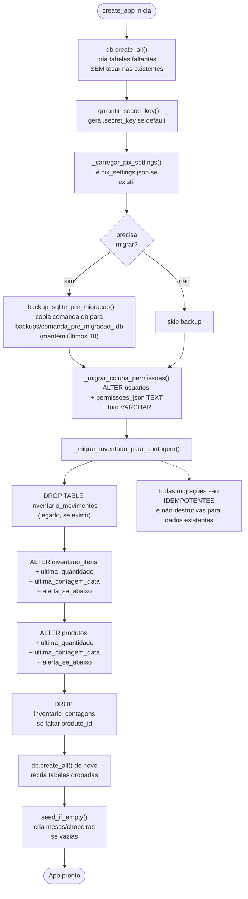

---

## 16. Persistência externa

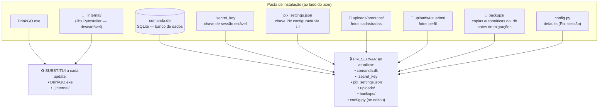

---

## 17. Build e deploy

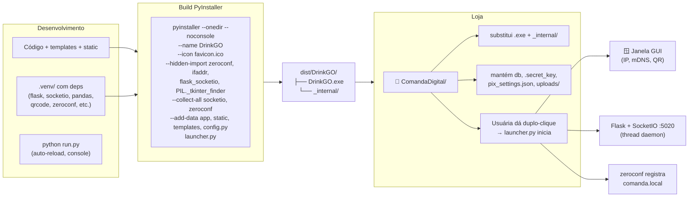

---

## 18. Rede local

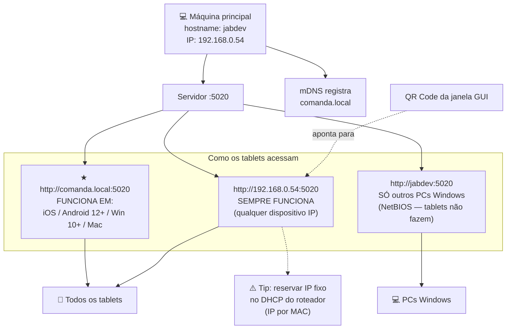

---

## 19. Sidebar e ícones

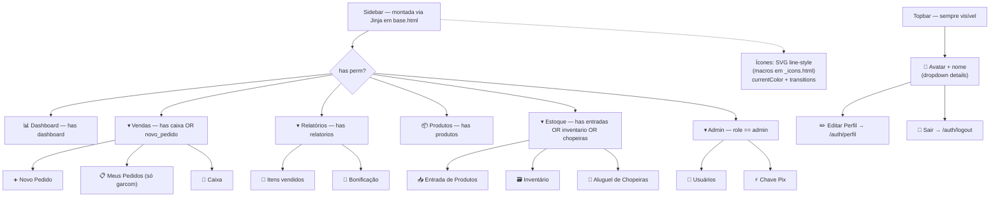

---

## Apêndice — fluxos transversais importantes

### A. Backup automático antes de migração

```mermaid
sequenceDiagram
    participant App
    participant Detector as _precisa_migrar()
    participant Disk as Disco
    participant Migra as Migrações

    App->>Detector: tem ALTER pendente?
    Detector->>Disk: inspect schema atual
    Detector-->>App: True/False
    alt True
        App->>Disk: shutil.copy2(comanda.db, backups/comanda_pre_migracao_<TS>.db)
        Disk-->>App: backup criado
        App->>Disk: rotaciona — mantém últimos 10
        App->>Migra: aplica ALTERs
    else False
        Note over App: nada a fazer
    end
```

### B. Permissão check com role admin sempre passa

```mermaid
flowchart LR
    Req[Request entra]
    Req --> Dec[@permissao_required key]
    Dec --> CheckLogin{logged in?}
    CheckLogin -- não --> Login[redirect /auth/login]
    CheckLogin -- sim --> CheckAdmin{role admin?}
    CheckAdmin -- sim --> Pass[passa direto]
    CheckAdmin -- não --> CheckPerm{tem permissão<br/>'key'?}
    CheckPerm -- sim --> Pass
    CheckPerm -- não --> Forbid[abort 403]
```

### C. Geração do payload Pix (BR Code)

```mermaid
flowchart TB
    Input[chave + nome + cidade + valor + txid]
    Input --> San["sanitiza:<br/>nome ASCII upper 25 chars<br/>cidade ASCII upper 15 chars"]
    San --> TLV["monta TLV EMV:<br/>00=Format Indicator<br/>01=Static<br/>26=MAI (br.gov.bcb.pix + chave)<br/>52=MCC<br/>53=BRL<br/>54=valor<br/>58=BR<br/>59=nome<br/>60=cidade<br/>62=TXID"]
    TLV --> Hash["CRC16-CCITT (XMODEM)<br/>do payload + '6304'"]
    Hash --> Final["payload completo<br/>+ '6304' + CRC4"]
    Final --> QRGen["qrcode.QRCode<br/>error_correction=M<br/>box_size=8"]
    QRGen --> PNG["PNG → BytesIO<br/>→ base64<br/>→ data:image/png;base64,..."]
```
